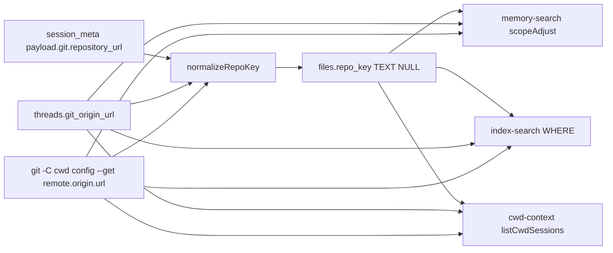

# 040 — wp4 프로젝트 정체성 키 (git repository_url)

날짜: 2026-09-10 (KST). 워크트리 `/Users/jun/.codex/worktrees/3412/codexclaw`, HEAD `369ed0e1` = `origin/dev` 트리. 이 문서는 diff-level 구현 설계다. 코드는 이 사이클에서 바꾸지 않았다.

등급: C3. 대상 컴포넌트: `plugins/codexclaw/components/recall`. 스키마 버전은 `"2"`에 고정한다. 12GB msgs 재파싱은 요구하지 않는다.

## 1. 목적과 범위

목적: `--cwd` / `--cwd-only` / SessionStart cwd 주입이 경로 접두사만이 아니라 같은 git 원격(`repo_key`)의 메인 체크아웃·다른 워크트리 히트도 한 프로젝트로 묶게 한다. 관리형 워크트리에서 메인이 다른 프로젝트처럼 빠지는 #108 설계 공백을 닫는다 (`000_plan.md` wp4, `notes/05`).

### IN

- 새 필드 `repo_key`의 생성 → 정규화 → 저장 → 소비 체인 (PLAN-FIELD-CHAIN-01).
- `--cwd <path>` 질의 시 `git -C path config --get remote.origin.url`로 구한 키를 접두사 히트와 동급으로 부스트/필터. origin 결측은 cwd 접두사 fallback.
- `cwdMatches`에 case-insensitive 옵션. 호출측은 호스트가 `darwin`일 때 켠다.
- 골든: 이 워크트리 cwd의 `--cwd-only`가 메인 체크아웃 요약을 포함하고 cli-jaw/opencodex origin은 제외.
- 같은 커밋의 `dist/*.js` (dist-freshness).

### OUT

- repo basename 단독 키 (`notes/05` P2, 동명 충돌).
- git worktree common dir을 검색 키로 승격 (session_meta에 없고 죽은 슬롯 재계산 불가).
- `cxc session bind` / `projects.project_id` 의존 (커버리지 0, 전부 NULL).
- `INDEX_SCHEMA_VERSION` 범프. 버전 불일치는 files/msgs drop 후 12GB 재파싱이다 (`index-db.ts:103-110`).
- wp3 스킬 문구 중 "Until wp4" 문단을 제외한 나머지, wp5 자연어, 네이티브 memories 주입. (A5: "Until wp4" 문단의 삭제·교체는 이 wp의 IN이다 — §3 파일 맵 SKILL.md 행.)

### 비범위 결정

Node 번들 SQLite는 3.53.0이다. `ALTER TABLE files ADD COLUMN IF NOT EXISTS repo_key TEXT`는 `near "EXISTS": syntax error`로 실패했다. `ADD COLUMN repo_key TEXT`는 되고, 두 번째 호출은 `duplicate column name: repo_key`다. 구현은 `PRAGMA table_info(files)`로 컬럼 존재 여부를 본 뒤 ALTER 한다. IF NOT EXISTS 문법에 의존하지 않는다.

## 2. 현재 코드

### 2.1 메타는 cwd만 저장하고 git 객체를 버린다

`readRolloutMeta`는 session_meta 첫 줄에서 `threadId, cwd, source, nickname, originator`만 꺼낸다. 오늘 아침 샘플 120개 중 119개가 `payload.git.repository_url`을 갖고, 이 워크트리 jsonl도 `https://github.com/lidge-jun/codexclaw.git`이다 (`notes/05`). 코드는 그 객체를 읽지 않는다.

`plugins/codexclaw/components/recall/src/rollout.ts:159-174`:

```ts
export function readRolloutMeta(path: string): RolloutMeta {
  const firstLine = readFirstLine(path);
  const fallback: RolloutMeta = { threadId: null, cwd: null, source: "main", nickname: null, originator: null };
  try {
    const j = JSON.parse(firstLine);
    if (j?.type !== "session_meta") return fallback;
    const p = j.payload ?? {};
    const isSub = p.thread_source === "subagent" || p.source?.subagent !== undefined;
    return {
      threadId: typeof p.id === "string" ? p.id : null,
      cwd: typeof p.cwd === "string" ? p.cwd : null,
      source: isSub ? "subagent" : "main",
      nickname: typeof p.agent_nickname === "string" ? p.agent_nickname : null,
      originator: typeof p.originator === "string" ? p.originator : null,
    };
  } catch {
    return fallback;
  }
}
```

`RolloutMeta` 타입 (`rollout.ts:20-26`)에도 git 필드가 없다.

실측 session_meta (2026-09-10 jsonl 첫 줄):

| 슬롯 | cwd | git.repository_url |
|---|---|---|
| 워크트리 3412 | `/Users/jun/.codex/worktrees/3412/codexclaw` | `https://github.com/lidge-jun/codexclaw.git` (branch 키 없음, commit `369ed0e1`) |
| 메인 | `/Users/jun/Developer/new/700_projects/codexclaw` | 같은 URL, `branch: "dev"` |

### 2.2 cwd 비교는 접두사고 대소문자를 접지 않는다

`normalizeCwd` / `cwdMatches` (`rollout.ts:68-91`). 주석은 macOS도 case-sensitive라고 적지만, 이 볼륨의 인덱스는 `/Users/jun/developer/...` 435 files가 `Developer` 질의와 불일치한다 (`notes/05`). 테스트는 경로 대소문자를 접지 말라고 고정한다 (`cwd-scope.test.ts:281-287`).

`plugins/codexclaw/components/recall/src/rollout.ts:77-91`:

```ts
export function normalizeCwd(cwd: string): string {
  const unified = cwd.replace(/\\/g, "/").replace(/\/+$/, "");
  return /^[a-z]:/.test(unified) ? unified[0].toUpperCase() + unified.slice(1) : unified;
}

export function cwdMatches(sessionCwd: string, prefix: string): boolean {
  const s = normalizeCwd(sessionCwd);
  const p = normalizeCwd(prefix);
  return s === p || s.startsWith(`${p}/`);
}
```

### 2.3 ingest는 files에 cwd만 넣고 변경 없는 파일은 메타를 다시 읽지 않는다

`ingest.ts:74-76` INSERT 컬럼: `path, mtime_ms, size, thread_id, cwd, source, date, bytes_ingested, last_ord`. `ingest.ts:105`는 mtime+size가 같으면 `continue` — 12GB msgs를 안 만지지만, 기존 행에 새 컬럼을 채우지도 않는다. append 경로(`ingest.ts:116-132`)는 `readRolloutMeta`를 다시 호출하므로 자라는 파일만 새 메타가 따라온다.

### 2.4 인덱스 스키마 버전 2, 컬럼 추가 패턴은 테이블 신설뿐

`INDEX_SCHEMA_VERSION = "2"` (`index-db.ts:18`). 불일치 시 files/msgs/FTS를 drop한다 (`index-db.ts:103-110`). `recall_hit_counts`는 버전을 안 올리고 `CREATE TABLE IF NOT EXISTS`로 붙였다 (`index-db.ts:29-46, 87`). files에 컬럼을 넣는 DDL은 없다. 라이브 인덱스 (`~/.codexclaw/recall/index.sqlite`, 읽기 전용): schema_version=2, files 13223, msgs 1227034, files 컬럼에 `repo_key` 없음. last_ingest_at `2026-09-09T22:06:44.989Z`.

### 2.5 검색 소비는 전부 cwd 문자열

memory `buildCwdScope` / `scopeAdjust` (`memory-search.ts:274-326`): 접두사 매칭이면 `CWD_BOOST = 2`, 본문 경로 언급이면 절반, `--cwd-only`면 그 외 drop. stage1 cwd는 `threads.cwd` 조인 (`memory-search.ts:608-611`). `loadThreadMeta`는 `git_origin_url`을 SELECT하지 않는다 (`threads-db.ts:32-42`).

chat SQL (`index-search.ts:131-136`): `f.cwd = ? OR f.cwd LIKE ?/%` (및 백슬래시 변형). 부스트 없이 필터. SQLite LIKE는 ASCII 대소문자를 접고, `=`는 접지 않는다.

훅 `listCwdSessions` (`cwd-context.ts:84-92`): `WHERE cwd = ? AND source = 'main'` 정확 일치. 신규 슬롯 3412는 인덱스에 그 cwd가 없어 SessionStart에 Recent work가 없었다 (`notes/03` §2, `hook.ts:503-507`). fallback 경로도 `hit.cwd === cwd` 정확 일치 (`hook.ts:455`).

### 2.6 Codex threads는 origin을 이미 갖고 있다

라이브 `~/.codex/state_5.sqlite` threads 컬럼 16이 `git_origin_url` (NULL 허용). 이 머신 codexclaw 잎:

| git_origin_url | n |
|---|---:|
| `https://github.com/lidge-jun/codexclaw.git` | 1351 |
| (빈 문자열) | 195 |

cwd 버킷: main 1398, worktree 148, other 5. 이 워크트리와 메인 체크아웃의 `git config --get remote.origin.url`은 둘 다 `https://github.com/lidge-jun/codexclaw.git`. cli-jaw 메인 origin은 `https://github.com/lidge-jun/cli-jaw.git`, opencodex는 `https://github.com/lidge-jun/opencodex.git`.

### 2.7 오늘 골든 기준선 (설치본, --no-refresh)

BIN: `node /Users/jun/.codex/plugins/cache/codexclaw/codexclaw/0.2.24+codex.20260908031619/bin/cxc.mjs`.

아침 노트(`notes/05`)는 이 cwd files 0건·`--cwd-only` 0건이었다. 이후 ingest가 이 세션을 넣어 기준선이 바뀌었다. 2026-09-10 재실행:

| 명령 | exit | hits | 관측 |
|---|---:|---:|---|
| `memory search "메모리" --cwd-only <3412> --no-refresh --json` | 0 | 5 | 메모리 아티팩트 0. chat fallback 5건 전부 cwd=3412, thread `01a0880e`. 경고 `no memory artifacts matched — 5 raw session message(s)`. elapsedMs 549. 메인 요약 없음. |
| `memory search "메모리" --cwd-only <메인 체크아웃> --no-refresh --json` | 0 | 4 | handbook MEMORY.md (cwd null, 본문 경로), rollout 요약 2 (cwd=메인), stage1 1 (cwd=메인). cli-jaw/opencodex cwd 없음. elapsedMs 135. |
| `chat search "메모리" --cwd <3412> --days 0 --limit 5 --no-refresh --json --no-tools` | 0 | 5 | 전부 3412 / `01a0880e`. 메인 체크아웃 파일 없음. truncated 경고. |

성공 판정은 워크트리 `--cwd-only`가 메인 cwd를 가진 요약/stage1을 포함하고, 히트 cwd가 cli-jaw·opencodex origin 경로가 아닌 것. 현재는 실패(메모리 아티팩트 0, 메인 미포함).

## 3. 변경 파일 맵

| 파일 | NEW/MODIFY/DELETE | 변경 요지 | 예상 줄수 |
|---|---|---|---:|
| `plugins/codexclaw/skills/recall/SKILL.md` | MODIFY | "Until wp4" 문단(030 §4 전문 기준)을 삭제하고 "같은 git origin(정규화된 repo_key)의 세션을 `--cwd`/`--cwd-only`가 함께 묶는다. origin이 없으면 cwd 접두사만 쓴다."로 교체 (A5) | -8/+4 |
| `plugins/codexclaw/components/recall/src/repo-key.ts` | NEW | `normalizeRepoKey`, `readOriginUrl`, `repoKeyForCwd`, `repoKeysEqual`. git는 `node:child_process.spawnSync`, 타임아웃 1500ms, 실패 시 null | +90 |
| `plugins/codexclaw/components/recall/src/rollout.ts` | MODIFY | `RolloutMeta.repoKey`. `readRolloutMeta`가 `payload.git.repository_url` 파싱. `cwdMatches`에 `caseInsensitive` 옵션 | +25 |
| `plugins/codexclaw/components/recall/src/ingest.ts` | MODIFY | files INSERT에 `repo_key`. ingest 시작 시 NULL 행 lazy backfill (threads 조인, msgs 재파싱 없음) | +40 |
| `plugins/codexclaw/components/recall/src/index-db.ts` | MODIFY | `ensureRepoKeyColumn`: PRAGMA 후 `ALTER TABLE files ADD COLUMN repo_key TEXT`. 버전 문자열 `"2"` 유지. `CREATE INDEX IF NOT EXISTS idx_files_repo_key` | +35 |
| `plugins/codexclaw/components/recall/src/index-search.ts` | MODIFY | WHERE: cwd 접두사 OR `f.repo_key = ?` OR `f.thread_id IN (...)`. darwin이면 cwd 동등 비교를 `lower()`. 컬럼 없으면 repo_key 항 생략 | +40 |
| `plugins/codexclaw/components/recall/src/threads-db.ts` | MODIFY | `ThreadMeta.gitOriginUrl`. SELECT에 `git_origin_url`. 컬럼 없는 픽스처 DB는 기존 SELECT로 fallback | +25 |
| `plugins/codexclaw/components/recall/src/memory-search.ts` | MODIFY | `CwdScope.repoKey`. 질의 시 `repoKeyForCwd(prefix)`. `scopeAdjust`가 cwd 접두사와 repo_key를 동급 부스트/필터 | +35 |
| `plugins/codexclaw/components/recall/src/cwd-context.ts` | MODIFY | `listCwdSessions`가 같은 `repo_key` / 같은 origin thread_id의 main 세션을 포함. origin 결측은 정확 cwd | +40 |
| `plugins/codexclaw/components/recall/src/hook.ts` | MODIFY | fallback 필터를 `cwd ===`에서 `cwdMatches`(+darwin)로. 헤더 `this CWD only` → `this project` | +15 |
| `plugins/codexclaw/components/recall/src/chat-search.ts` | MODIFY | 질의 `repoKey` 1회 계산. scan 경로도 접두사 또는 repo_key. index 경로에 키/thread id 전달 | +20 |
| `plugins/codexclaw/components/recall/src/cli.ts` | MODIFY | USAGE: `--cwd`가 같은 git origin을 포함한다고 적음 | +8 |
| `plugins/codexclaw/components/recall/test/repo-key.test.ts` | NEW | URL 정규화·ssh/https 동치·결측 null·git stub | +90 |
| `plugins/codexclaw/components/recall/test/cwd-scope.test.ts` | MODIFY | 메인↔워크트리 연합, 다른 origin 제외, origin 결측 fallback, darwin 대소문자 | +90 |
| `plugins/codexclaw/components/recall/test/cwd-context.test.ts` | MODIFY | 다른 cwd·같은 repository_url 세션이 목록에 들어옴 | +50 |
| `plugins/codexclaw/components/recall/test/fixtures.ts` | MODIFY | `sessionMeta`에 optional git. threads 픽스처에 `git_origin_url` 컬럼 | +20 |
| `plugins/codexclaw/components/recall/test/index.test.ts` | MODIFY | ingest가 repo_key를 저장. cwd 질의 oracle에 같은 origin 다른 cwd 케이스 | +25 |
| `plugins/codexclaw/components/recall/test/round2.test.ts` | MODIFY | `cwdMatches(..., { caseInsensitive: true })` 고정 | +15 |
| `plugins/codexclaw/components/recall/test/hook.test.ts` | MODIFY | 헤더 문구, 다른 프로젝트 배제 유지 | +10 |
| `plugins/codexclaw/components/recall/dist/*.js` (아래 §7) | MODIFY/NEW | `npm run build` 결과. 같은 커밋에 포함 | (생성) |

DELETE 없음. msgs 테이블은 그대로다.

## 4. 변경 상세

### PLAN-FIELD-CHAIN-01



| 단계 | path | 결측 시 |
|---|---|---|
| 생성 (ingest) | `rollout.ts` `readRolloutMeta` ← `payload.git.repository_url` | 필드 없음/빈 문자열 → `repo_key = null`. ingest 시 git 명령 없음 (jsonl만). |
| 생성 (검색·훅) | `repo-key.ts` `readOriginUrl(cwd)` = `git -C cwd config --get remote.origin.url` | spawn 실패·exit≠0·빈 stdout → null, cwd 접두사만. |
| 생성 (조인) | `threads-db.ts` `loadThreadMeta` SELECT `git_origin_url` | 컬럼 없는 픽스처는 fallback SELECT, 값은 null. |
| 정규화 | `repo-key.ts` `normalizeRepoKey` | 파싱 실패 → null. |
| 저장 | `index-db.ts` ALTER + `ingest.ts` INSERT `files.repo_key` | 기존 행 NULL. msgs 컬럼 없음 (1.2M 행 복제는 12GB에 가깝다). |
| lazy backfill | `ingest.ts` 시작: `repo_key IS NULL`인 files를 threads.origin으로 UPDATE | thread_id 없거나 origin 빈 행은 NULL 유지, cwd fallback. jsonl 13k head 재읽기는 P0 아님. |
| 소비 memory | `memory-search.ts` `scopeAdjust` | 질의 repo_key와 히트 thread origin이 같으면 접두사와 동급 (`CWD_BOOST`). |
| 소비 chat SQL | `index-search.ts` `candidateFilter` | 접두사 OR `files.repo_key` OR `thread_id IN (같은 origin)`. 컬럼 없는 RO 인덱스는 IN 절만. |
| 소비 훅 | `cwd-context.ts` `listCwdSessions` | `source='main'` 유지. cwd 정확/darwin lower 또는 같은 repo_key/thread. |
| 소비 scan | `chat-search.ts:277` | `cwdMatches` 또는 `meta.repoKey`. |

정규화 규칙 (호스트만 소문자, 경로 대소문자는 유지, basename 단독 금지):

- 끝의 `.git` / 끝 슬래시 제거.
- `git@host:path` (scp)와 `ssh://` / `https://` / `git://` 를 `host/path`로.
- userinfo·포트 버림.
- 예: `https://github.com/lidge-jun/codexclaw.git`, `git@github.com:lidge-jun/codexclaw.git`, `ssh://git@github.com/lidge-jun/codexclaw` → `github.com/lidge-jun/codexclaw`.
- cli-jaw의 두 origin (`bitkyc08-arch/cli-jaw` vs `lidge-jun/cli-jaw`)은 다른 키로 남는다.

`--no-refresh`는 `openIndexReadOnly`라 ALTER/backfill을 못 한다 (`index-db.ts:118-126`). 메모리 골든은 threads 조인만으로 통과해야 한다. chat/훅은 thread_id IN 으로 같은 우회를 쓴다. 컬럼은 다음 RW ingest가 채운다.

### 4.1 NEW `repo-key.ts`

```ts
import { spawnSync } from "node:child_process";

export type ReadOriginUrl = (cwd: string) => string | null;

export function normalizeRepoKey(raw: string | null | undefined): string | null {
  if (typeof raw !== "string") return null;
  const trimmed = raw.trim();
  if (trimmed === "") return null;

  const scp = /^([^@\s]+)@([^:]+):(.+)$/.exec(trimmed);
  if (scp && !trimmed.includes("://")) {
    return pack(scp[2], scp[3]);
  }
  try {
    const u = new URL(trimmed);
    return pack(u.hostname, u.pathname);
  } catch {
    return null;
  }
}

function pack(host: string, path: string): string | null {
  const h = host.trim().toLowerCase();
  const p = path.replace(/\.git$/i, "").replace(/\/+$/, "").replace(/^\/+/, "");
  if (h === "" || p === "") return null;
  return `${h}/${p}`;
}

export function readOriginUrl(cwd: string): string | null {
  if (!cwd.trim()) return null;
  try {
    const r = spawnSync("git", ["-C", cwd, "config", "--get", "remote.origin.url"], {
      encoding: "utf8",
      timeout: 1500,
      stdio: ["ignore", "pipe", "ignore"],
    });
    if (r.status !== 0) return null;
    const out = (r.stdout ?? "").trim();
    return out === "" ? null : out;
  } catch {
    return null;
  }
}

export function repoKeyForCwd(cwd: string, readUrl: ReadOriginUrl = readOriginUrl): string | null {
  return normalizeRepoKey(readUrl(cwd));
}

export function repoKeysEqual(a: string | null | undefined, b: string | null | undefined): boolean {
  return typeof a === "string" && typeof b === "string" && a !== "" && a === b;
}
```

테스트는 `readUrl`을 주입해 실제 git에 안 붙는다. 기본 구현만 spawn한다. 써드파티 import 없음.

### 4.2 MODIFY `rollout.ts`

`RolloutMeta`에 `repoKey: string | null`를 추가한다. fallback 객체도 `repoKey: null`.

`readRolloutMeta` return 직전에:

```ts
const git = p.git && typeof p.git === "object" ? (p.git as Record<string, unknown>) : null;
const repositoryUrl = git && typeof git.repository_url === "string" ? git.repository_url : null;
return {
  threadId: typeof p.id === "string" ? p.id : null,
  cwd: typeof p.cwd === "string" ? p.cwd : null,
  source: isSub ? "subagent" : "main",
  nickname: typeof p.agent_nickname === "string" ? p.agent_nickname : null,
  originator: typeof p.originator === "string" ? p.originator : null,
  repoKey: normalizeRepoKey(repositoryUrl),
};
```

import: `import { normalizeRepoKey } from "./repo-key.ts";`

`cwdMatches` after:

```ts
export function cwdMatches(
  sessionCwd: string,
  prefix: string,
  opts?: { caseInsensitive?: boolean },
): boolean {
  const fold = opts?.caseInsensitive === true;
  const s0 = normalizeCwd(sessionCwd);
  const p0 = normalizeCwd(prefix);
  const s = fold ? s0.toLowerCase() : s0;
  const p = fold ? p0.toLowerCase() : p0;
  return s === p || s.startsWith(`${p}/`);
}
```

기본은 지금과 같다 (옵션 생략 = 대소문자 유지). `normalizeCwd` 자체는 경로 대소문자를 접지 않는다 (`cwd-scope.test.ts:287` 유지). 호출측:

```ts
cwdMatches(hitCwd, prefix, { caseInsensitive: process.platform === "darwin" })
```

win32는 이 사이클에서 켜지 않는다 (요구 (c)가 darwin).

### 4.3 MODIFY `index-db.ts`

`INDEX_SCHEMA_VERSION`은 `"2"` 그대로. `SCHEMA`의 CREATE TABLE files 목록에 `repo_key TEXT`를 넣어 신규 DB는 처음부터 컬럼을 갖게 한다. 기존 12GB DB는 CREATE TABLE IF NOT EXISTS가 컬럼을 추가하지 않으므로, 버전 일치 분기 뒤에:

```ts
function filesHasColumn(db: RwDb, name: string): boolean {
  const cols = db.prepare("PRAGMA table_info(files)").all() as Array<{ name: string }>;
  return cols.some((c) => c.name === name);
}

export function ensureRepoKeyColumn(db: RwDb): void {
  if (!filesHasColumn(db, "repo_key")) {
    db.exec("ALTER TABLE files ADD COLUMN repo_key TEXT");
  }
  db.exec("CREATE INDEX IF NOT EXISTS idx_files_repo_key ON files(repo_key)");
}
```

`openIndex`에서 `SCHEMA` exec 및 버전 처리 후 `ensureRepoKeyColumn(db)`를 호출한다. drop-rebuild 분기도 SCHEMA에 컬럼이 있으므로 새 DB는 ALTER가 no-op가 된다.

`openIndexReadOnly`는 DDL을 실행하지 않는다 (`index-db.ts:118-126`). 독자는 `PRAGMA table_info`로 컬럼 유무를 보고 SQL을 갈라야 한다 (`recall_hit_counts`와 같은 계약, `index-db.ts:37-38`).

### 4.4 MODIFY `ingest.ts`

INSERT:

```ts
const insFile = db.prepare(
  "INSERT OR REPLACE INTO files (path, mtime_ms, size, thread_id, cwd, source, date, bytes_ingested, last_ord, repo_key)" +
    " VALUES (?, ?, ?, ?, ?, ?, ?, ?, ?, ?)",
);
```

`insFile.run(..., meta.repoKey)` 를 full/append 양쪽 (`ingest.ts:122-132`, `ingest.ts:142`)에 넣는다.

skip (`ingest.ts:105`)은 그대로 둔다. 그 앞에서 한 번만 backfill:

```ts
function backfillRepoKeysFromThreads(home: string, db: RwDb): void {
  const pending = db.prepare("SELECT COUNT(*) AS n FROM files WHERE repo_key IS NULL AND thread_id IS NOT NULL").get() as { n: number };
  if (pending.n === 0) return;
  const meta = loadThreadMeta(stateDbPath(home));
  const upd = db.prepare("UPDATE files SET repo_key = ? WHERE thread_id = ? AND repo_key IS NULL");
  db.exec("BEGIN");
  try {
    for (const [id, t] of meta.byId) {
      const key = normalizeRepoKey(t.gitOriginUrl);
      if (key) upd.run(key, id);
    }
    db.exec("COMMIT");
  } catch (err) {
    db.exec("ROLLBACK");
    throw err;
  }
}
```

이건 files 13k UPDATE이지 msgs 1.2M 재파싱이 아니다. jsonl head 13k 재읽기는 P0에서 하지 않는다 (훅 10s 예산, SessionStart가 `openIndex`를 연다 `hook.ts:228-232`). origin이 비고 jsonl에만 URL이 있는 행은 다음 full re-parse(파일 변경) 때 채워지거나 cwd fallback으로 산다.

import: `loadThreadMeta` from `./threads-db.ts`, `stateDbPath` from `./paths.ts`, `normalizeRepoKey` from `./repo-key.ts`.

### 4.5 MODIFY `threads-db.ts`

`ThreadMeta`에 `gitOriginUrl: string | null`. 우선:

```ts
const rows = db
  .prepare("SELECT id, title, cwd, git_branch, git_origin_url, updated_at_ms FROM threads")
  .all() as Array<Record<string, unknown>>;
```

`git_origin_url` 컬럼이 없으면 (픽스처 `fixtures.ts:121-122`, `cwd-scope.test.ts:44-45`) prepare가 실패하고 지금 분기는 메타 전체를 비운다 (`threads-db.ts:45-47`). 그러면 cwd-scope 테스트가 깨지므로 catch 안에서 구 SELECT를 한 번 더 시도한다. 구행의 `gitOriginUrl`은 null. 픽스처 CREATE TABLE에 컬럼을 추가하는 쪽이 더 짧고, catch fallback은 옛 state DB 방어용으로 남긴다.

빈 문자열 origin은 null로 정규화한다: `typeof r.git_origin_url === "string" && r.git_origin_url.trim() !== "" ? r.git_origin_url : null`.

### 4.6 MODIFY `memory-search.ts`

`CwdScope`에 `repoKey: string | null`와 주입점 `readOriginUrl?: ReadOriginUrl` (`MemorySearchOptions`). `buildCwdScope`는 prefix를 만든 뒤 한 번만 `repoKeyForCwd(prefix, opts.readOriginUrl)`. git를 히트마다 호출하지 않는다.

`scopeAdjust` after:

```ts
function scopeAdjust(
  scope: CwdScope | null,
  hitCwd: string | null,
  lowerText: string,
  hitRepoKey: string | null,
): { keep: boolean; bonus: number } {
  if (scope === null) return { keep: true, bonus: 0 };
  const cwdHit =
    hitCwd !== null &&
    hitCwd !== "" &&
    cwdMatches(hitCwd, scope.prefix, { caseInsensitive: process.platform === "darwin" });
  const repoHit = repoKeysEqual(scope.repoKey, hitRepoKey);
  if (cwdHit || repoHit) return { keep: true, bonus: CWD_BOOST };
  const mentioned = scope.lowerPrefixes.some((p) => lowerText.includes(p));
  if (mentioned) return { keep: true, bonus: CWD_BOOST / 2 };
  return { keep: !scope.only, bonus: 0 };
}
```

파일 경로 (`memory-search.ts:425-431`)와 stage1 (`memory-search.ts:610-612`)에서

```ts
const tm = threadId ? scope?.threadCwd.get(threadId) : undefined;
const fileCwd = frontmatterCwd(content) ?? tm?.cwd ?? null;
const hitRepoKey = normalizeRepoKey(tm?.gitOriginUrl);
const scoped = scopeAdjust(scope, fileCwd, lower, hitRepoKey);
```

질의 origin이 null이면 `repoHit`는 항상 false → 현재와 같은 접두사(+본문)만. chat fallback의 hard scope (`memory-search.ts:531`)는 그대로 `cwd: scope.prefix`를 넘기고, chat 엔진이 repo_key를 이해한다.

### 4.7 MODIFY `index-search.ts` / `chat-search.ts`

`IndexQueryOptions`에 `repoKey: string | null`, `repoThreadIds: string[]`. `candidateFilter` cwd 블록 after:

```ts
if (opts.cwd) {
  const cwdEq =
    process.platform === "darwin" ? "lower(f.cwd) = lower(?)" : "f.cwd = ?";
  const parts = [
    cwdEq,
    "f.cwd LIKE ? ESCAPE '\\'",
    "f.cwd LIKE ? ESCAPE '\\'",
  ];
  params.push(opts.cwd, `${escapeLike(opts.cwd)}/%`, `${escapeLike(opts.cwd)}\\\\%`);
  if (opts.repoKey && opts.hasRepoKeyColumn) {
    parts.push("(f.repo_key IS NOT NULL AND f.repo_key = ?)");
    params.push(opts.repoKey);
  }
  if (opts.repoThreadIds.length > 0) {
    parts.push(`f.thread_id IN (${opts.repoThreadIds.map(() => "?").join(",")})`);
    params.push(...opts.repoThreadIds);
  }
  conds.push(`(${parts.join(" OR ")})`);
}
```

`queryIndex` 앞에서 `PRAGMA table_info(files)`로 `hasRepoKeyColumn`을 본다. `loadThreadMeta`는 이미 호출된다 (`index-search.ts:257`). 질의 `repoKey`가 있으면 origin이 같은 thread id를 모아 `repoThreadIds`로 넣는다. IN 절은 이 머신 codexclaw ~1546 id, SQLite 변수 한도 아래.

scan 경로 (`chat-search.ts:277`) after:

```ts
if (opts.cwd) {
  const prefixHit = cwdMatches(meta.cwd ?? "", opts.cwd, {
    caseInsensitive: process.platform === "darwin",
  });
  const repoHit = repoKeysEqual(queryRepoKey, meta.repoKey);
  if (!prefixHit && !repoHit) continue;
}
```

`queryRepoKey`는 `searchChat` 진입에서 한 번 계산한다. 파일마다 git 하지 않는다.

### 4.8 MODIFY `cwd-context.ts` / `hook.ts`

`listCwdSessions` opts에 `readOriginUrl?: ReadOriginUrl`. cwd로 `repoKeyForCwd` 후, 키가 있으면 `loadThreadMeta(stateDbPath())`에서 같은 origin thread id를 모은다. SQL:

```ts
WHERE source = 'main' AND (
  cwd = ? OR lower(cwd) = lower(?)   -- darwin일 때만 lower 항
  OR (repo_key IS NOT NULL AND repo_key = ?)  -- 컬럼 있을 때만
  OR thread_id IN (...)                       -- id가 있을 때만
)
ORDER BY date DESC, path DESC LIMIT ?
```

다른 프로젝트 세션은 origin이 달라 IN/repo_key에 안 들어간다. git 실패 시 지금과 같은 `cwd = ?`.

`hook.ts:286` 헤더를 `Recent work — ${cwdName} (this project):` 로 바꾼다. `hook.ts:307` `Scope: CWD-local` → `Scope: project-local (cwd prefix or same git origin)`. fallback `hook.ts:455` `hit.cwd === cwd` → `cwdMatches(hit.cwd ?? "", cwd, { caseInsensitive: process.platform === "darwin" })`. `listCwdSessions`가 이미 연합하면 fallback은 안 탄다.

### 4.9 MODIFY 픽스처

`fixtures.ts` `sessionMeta`에 optional `repositoryUrl?: string` → `payload.git = { repository_url }`. threads CREATE TABLE에 `git_origin_url TEXT`를 넣고 INSERT에 값을 준다. 기존 테스트는 URL 없이 동작(null → 접두사만)해야 한다.

## 5. 테스트 계획

런타임: `node:test` + `node:assert/strict`. 컴포넌트 cwd에서 `node --test`. 라이브 12GB 인덱스는 유닛이 만지지 않는다 (`--home` / temp index). git은 `readOriginUrl` stub.

| 파일 | 케이스 | 활성화 시나리오 |
|---|---|---|
| `test/repo-key.test.ts` NEW | https/.git/host 대문자 | 입력 `https://GitHub.com/lidge-jun/codexclaw.git` → `github.com/lidge-jun/codexclaw` |
| 같은 파일 | scp ssh 동치 | `git@github.com:lidge-jun/codexclaw.git`와 `ssh://git@github.com/lidge-jun/codexclaw`가 https와 같은 키 |
| 같은 파일 | 결측 | `null`, `""`, `"  "` → `null` |
| 같은 파일 | 서로 다른 fork | `bitkyc08-arch/cli-jaw` ≠ `lidge-jun/cli-jaw` |
| 같은 파일 | spawn 실패 | stub이 null → `repoKeyForCwd` null |
| `test/cwd-scope.test.ts` | 메인 질의 ↔ 워크트리 기록 연합 | 요약 cwd=`/proj/main`, threads.origin=같은 URL. `searchMemory(q, { cwd: "/wt/slot", cwdOnly: true, readOriginUrl: () => url })` → 그 요약 keep, bonus=`CWD_BOOST` |
| 같은 파일 | 다른 origin 제외 | there 요약 origin=cli-jaw URL. 같은 질의에서 drop |
| 같은 파일 | origin 결측 fallback | stub null, cwd만 다름 → 지금처럼 워크트리 요약만, 메인 drop |
| 같은 파일 | 기존 접두사/boost/prose | `buildScopedHome` 케이스 그대로 통과 (픽스처 origin null 또는 서로 다름) |
| 같은 파일 | darwin 대소문자 | `cwdMatches("/Users/jun/developer/x", "/Users/jun/Developer/x", { caseInsensitive: true })` true. 옵션 false면 false. `process.platform === "darwin"` 분기 테스트는 옵션 직접 전달로 고정 |
| `test/index.test.ts` | ingest가 repo_key 저장 | fixture session_meta에 git URL. ingest 후 `SELECT repo_key FROM files`가 정규화 키 |
| 같은 파일 | 기존 oracle | `cwd: "/proj/alpha"` 세트 동등성 유지 (sub cwd는 접두사, beta는 제외, git 없음) |
| 같은 파일 | 같은 origin 다른 cwd SQL | 두 롤아웃 cwd=/proj/alpha, /wt/alpha 같은 URL. `searchChat(..., { cwd: "/wt/alpha", readOriginUrl })`가 둘 다 히트 |
| `test/cwd-context.test.ts` | 연합 목록 | 슬롯 cwd와 메인 cwd 롤아웃, 같은 repository_url, source=main. `listCwdSessions(slot, n, { indexPath, readOriginUrl })`에 메인 excerpt 포함 |
| 같은 파일 | 다른 프로젝트 배제 유지 | `/other/project` 비밀 문구 없음 (`cwd-context.test.ts:103-110`) |
| 같은 파일 | git 없는 해시 슬롯 | 현재 CWD=`/hash/worktrees/1fa9/project` 픽스처, stub 없음 → 길이 2 유지 |
| `test/round2.test.ts` | 접두사 경계 | `/proj/alphabet` vs `/proj/alpha` false 유지 |
| `test/hook.test.ts` | 다른 cwd 배제 | mock searchChat이 `/repo/other`를 줘도 본문에 비밀 없음 |
| 같은 파일 | 헤더 | `this project` 매칭, untrusted delimiter 유지 |
| `test/fixtures.ts` | DDL | threads에 `git_origin_url` 컬럼. 기존 INSERT는 NULL 가능 |

라이브 골든 (구현 후, 설치 캐시 재설치, `--no-refresh`):

```
node "$BIN" memory search "메모리" --cwd-only /Users/jun/.codex/worktrees/3412/codexclaw --no-refresh --json
```

통과: hits 중 cwd가 `/Users/jun/Developer/new/700_projects/codexclaw` 인 rollout/stage1이 1건 이상. cwd가 `cli-jaw` 또는 `opencodex` 세그먼트인 히트 0. 오늘 기준선은 메모리 아티팩트 0 + chat 5건(3412만)이라 실패.

SessionStart: 신규 슬롯 픽스처에서 `[cxc-recall] Recent work`가 같은 origin의 이전 main 세션 excerpt를 포함한다 (`notes/03` P1).

## 6. 검증 명령 (PLAN-VERIFIER-REAL-01)

실행 시각 2026-09-10. 코드 미변경 상태.

### 6.1 컴포넌트 테스트

명령: `cd plugins/codexclaw/components/recall && node --test`

이 디렉터리에서 `node --test`는 `test/*.test.ts`를 파일 탐색으로 연다 (138 tests). cwd-scope / index / cwd-context / fixtures / hook / round2가 그 glob에 들어 있다.

결과: **exit 1**. 137 pass / 1 fail. 실패는 `test/chat-fallback.test.ts:176` `cli: memory search falls back to the real chat engine, and --no-chat opts out` — 픽스처 home의 archived `aardwolf`가 CLI 주입 `searchChat`의 기본 인덱스 경로(`indexPath()`, 연산자 사이드카)로 가서 0건. wp4 대상 파일이 아니다. 구현 후 같은 명령이 cwd-scope·index·cwd-context 신규 케이스를 포함해 이 fail 외에는 초록이어야 한다.

### 6.2 dist-freshness

명령 (레포 루트): `node plugins/codexclaw/scripts/test.mjs "plugins/codexclaw/test/dist-freshness.test.mjs"`

근거: `scripts/test.mjs`가 `process.argv.slice(2)`를 `node --test`에 그대로 넘긴다. 그 테스트는 `build.mjs`의 `COMPONENTS`(그 안에 `"recall"`)를 순회하며 각 `src/**/*.ts`를 `compileSource`한 바이트와 tracked `dist/**/*.js`를 비교한다. recall src를 실제로 읽는다.

결과: **exit 0**. 1 pass.

### 6.3 ALTER 문법 (구현 전 실측)

Node `node:sqlite` sqlite_version **3.53.0**.

- `ALTER TABLE files ADD COLUMN IF NOT EXISTS repo_key TEXT` → `near "EXISTS": syntax error`
- `ALTER TABLE files ADD COLUMN repo_key TEXT` → ok, 기존 행은 NULL
- 같은 컬럼 재실행 → `duplicate column name: repo_key`

구현은 PRAGMA 가드. 버전 범프 없음.

## 7. dist 재생성

루트 `package.json` scripts.build = `node plugins/codexclaw/scripts/build.mjs`. recall src를 고치면 같은 커밋에 `npm run build` 결과 dist를 넣는다.

바뀔 파일:

| dist | 이유 |
|---|---|
| `plugins/codexclaw/components/recall/dist/repo-key.js` | NEW 모듈 |
| `dist/rollout.js` | repoKey 파싱, cwdMatches 옵션 |
| `dist/ingest.js` | INSERT 컬럼, backfill |
| `dist/index-db.js` | ensureRepoKeyColumn |
| `dist/index-search.js` | WHERE |
| `dist/threads-db.js` | gitOriginUrl |
| `dist/memory-search.js` | scopeAdjust |
| `dist/cwd-context.js` | 연합 SELECT |
| `dist/hook.js` | 헤더·fallback 매칭 |
| `dist/chat-search.js` | scan/index에 repoKey |
| `dist/cli.js` | USAGE |

`sqlite.js` / `paths.js` / `query-words.js` 등은 src 미변경이면 dist도 그대로. freshness 테스트가 불일치를 막는다.

## 8. 위험·롤백

| 위험 | 대응 |
|---|---|
| 버전을 `"3"`으로 올리면 라이브 12GB drop+재ingest | **하지 않는다.** 이 설계는 범프 없음. 범프가 필요해지면 NEEDS_HUMAN. |
| `ADD COLUMN IF NOT EXISTS` 문법 없음 | PRAGMA + ALTER. 중복 컬럼은 에러이므로 가드 필수. |
| `--no-refresh` RO 인덱스는 컬럼/backfill 없음 | 검색은 threads.git_origin_url IN 절로 골든을 통과. 컬럼은 다음 RW ingest가 채움. |
| ingest skip이 기존 NULL을 안 채움 (`ingest.ts:105`) | backfill UPDATE를 skip 앞에 둔다. msgs는 안 읽는다. |
| SessionStart `openIndex` RW가 13k jsonl head를 읽으면 훅 10s | jsonl 재읽기 없음. threads 맵 UPDATE만. |
| cli-jaw 이중 origin | 정규화가 합치지 않음. 의도 (fork 구분). |
| darwin 기본 접기가 Linux CI와 달라짐 | `cwdMatches` 기본은 민감. darwin만 호출측 옵션. |
| MEMORY.md 본문 경로 절반 부스트가 다른 레포를 넣을 가능성 | 본문 신호는 질의 path 문자열. 워크트리 절대경로는 핸드북에 없음 (오늘 워크트리 --cwd-only에 MEMORY.md 없음). |
| chat fallback이 메모리 히트가 생기면 안 탐 | 골든은 메인 요약 포함이 목표. 현재 세션 raw chat은 chat search 경로. |
| 기존 fail `chat-fallback.test.ts:176` | wp4가 고치지 않음. 회귀로 세지 않음. |

롤백: PR revert. 컬럼이 이미 ALTER된 인덱스는 남아도 구 코드는 SELECT 목록에 `repo_key`가 없어 무시. 구 코드로 돌아가도 drop하지 않는다. 재ingest 불필요.

### NEEDS_HUMAN

없음. 스키마 버전 범프 없는 ADD COLUMN + NULL 허용 + threads lazy UPDATE는 12GB 재ingest를 요구하지 않는다. 나중에 `INDEX_SCHEMA_VERSION`을 올리는 변경이 생기면 그때 NEEDS_HUMAN.

## 9. PR 제목·본문 초안

제목 (영어):

`feat(recall): treat git origin as a project key for --cwd scope`

스택: 이 레포 `enforce-pr-target.yml`은 모든 기능 PR base를 `dev`로 강제한다. GitHub PR 그래프가 아니라 로컬 브랜치 체인 + 머지 순서가 스택이다 (`000_plan.md` 로드맵).

| 순서 | work-phase | 로컬 브랜치 (예정) | GitHub base | 의존 |
|---|---|---|---|---|
| 1 | wp1 memory-write gate | `codex/memory-l1-wp1-write-gate` | `dev` | 없음 |
| 2 | wp2 symbol boundary | `codex/memory-l1-wp2-symbol-boundary` | `dev` | wp1 머지 후 ff |
| 3 | wp3 recall skill/docs | `codex/memory-l1-wp3-recall-skill` | `dev` | wp1·wp2 머지 후 문구 확정 |
| 4 | **wp4 이 PR** | `codex/memory-l1-wp4-project-identity` | `dev` | wp3 뒤 (스킬의 워크트리 --cwd-only 안내를 이 동작에 맞춤) |

본문 초안:

```
## Summary
Managed worktrees and the main checkout of the same git remote are different cwd prefixes, so --cwd / --cwd-only / SessionStart recall treat them as different projects. This change adds files.repo_key (normalized git origin) without bumping INDEX_SCHEMA_VERSION, and ranks/filters same-origin hits with the path prefix.

## Behavior
- Ingest reads session_meta payload.git.repository_url into files.repo_key.
- Search-time --cwd PATH also runs git -C PATH config --get remote.origin.url.
- Normalization: strip .git, lowercase host, ssh and https are the same key. Missing origin keeps cwd-prefix fallback.
- macOS (darwin): cwdMatches may ignore path case.
- Existing 12GB msgs table is not rebuilt. Column add is ALTER + NULL; lazy backfill is an UPDATE from threads.git_origin_url.

## Test plan
- node --test in plugins/codexclaw/components/recall
- node plugins/codexclaw/scripts/test.mjs plugins/codexclaw/test/dist-freshness.test.mjs
- Golden (installed BIN, --no-refresh):
  memory search "메모리" --cwd-only <this worktree>
  must include a main-checkout summary and must not include cli-jaw/opencodex cwd hits.

## Stack
Base is always dev (enforce-pr-target). Land after wp3. Local branch: codex/memory-l1-wp4-project-identity.
```

## 근거

- `000_plan.md` wp4, 골든 표.
- `notes/05_project-identity-scoping.md` 분포·키 비교·P0/P1.
- `notes/03_hook-runtime-audit.md` §2 exact cwd=`cwd-context.ts:84-92`.
- 라이브: files 스키마, threads.git_origin_url 집계, 설치본 세 명령, sqlite 3.53.0 ALTER, recall `node --test` 137/138, dist-freshness exit 0.

## 검증 명령 정정 (메인, 2026-09-10 07:25)

이 문서가 기록한 recall 컴포넌트 `node --test` exit 1(`chat-fallback.test.ts:176`)은 코드 결함이 아니라 러너 미사용 탓이다. 그 테스트는 memory→chat 폴백이 사이드카 인덱스를 읽는데, `CODEXCLAW_HOME`을 덮지 않으면 사용자 실인덱스(12GB)를 읽어 합성 픽스처 `aardwolf`를 못 찾는다. 레포 러너 `plugins/codexclaw/scripts/test.mjs`(`CODEXCLAW_HOME`을 임시 디렉터리로 덮음, test.mjs:7-11)로 돌리면 9/9 통과, exit 0이다(메인 세션 실측). 이후 모든 C 단계 검증은 다음 형태를 쓴다.

```bash
node plugins/codexclaw/scripts/test.mjs "plugins/codexclaw/components/<comp>/test/*.test.ts"
node plugins/codexclaw/scripts/test.mjs "plugins/codexclaw/test/dist-freshness.test.mjs"
```

## A 감사 반영 (round 1, 2026-09-10)

blocker #5: §1 IN에 다음을 추가한다 — `plugins/codexclaw/skills/recall/SKILL.md`의 "Until wp4" 문단(030 §4의 SKILL.md 전문 기준 해당 절)을 삭제하고 "같은 git origin(정규화된 repo_key)의 세션을 `--cwd`/`--cwd-only`가 함께 묶는다. origin이 없으면 cwd 접두사만 쓴다."로 교체. OUT의 "wp3 스킬 문구"는 이 문단을 제외한 나머지를 뜻한다. 이에 따라 파일 맵에 `skills/recall/SKILL.md MODIFY (약 -8/+4줄)`가 추가된다.

B6(구버전 CLI 공존): `ingest.ts:74-76`의 `INSERT OR REPLACE INTO files (...)`는 명시 컬럼 목록이라, 설치본 0.2.24가 같은 인덱스를 다시 ingest하면 그 파일 행의 `repo_key`가 NULL로 돌아간다. 다음 신코드 실행의 lazy backfill(§4.4)이 다시 채우므로 데이터 손실은 없지만 일시적으로 스코핑에서 빠진다. §8 롤백/공존 표에 이 쓰기 경로를 추가하고, backfill이 "repo_key IS NULL AND cwd IS NOT NULL" 행만 대상으로 하도록 명시한다(멱등).

Low(backfill 트랜잭션): `ingest.ts:145`가 파일별 트랜잭션을 이미 열므로 backfill은 그 루프 밖에서 별도 `BEGIN ... COMMIT`으로 1,000행 단위 배치로 돈다(중첩 트랜잭션 금지). §4.4의 의사코드를 그렇게 읽는다.

행 번호 정정: `readRolloutMeta`는 `rollout.ts:160-178`.


## P 재검증 (wp4 사이클, 2026-09-10)

기준 트리 `b60d0ca8`(origin/dev, #126 머지 직후). 계획 이후 recall에서 바뀐 것은 wp2(#125)의 `query-words.ts`(+42)·`memory-search.ts`(+85: groupHit/markGroupPresence/fillStage1Presence, collect 2인자)와 wp3(#126)의 SKILL.md(268줄)다. 이 문서가 인용한 `memory-search.ts` 행 번호(`scopeAdjust`/`buildCwdScope`/`collect` 주변)는 밀렸으므로 B는 행이 아니라 심볼로 찾는다; 의미는 그대로다(`collect`는 이제 `(active, tallyPresence)`이며 repo_key 부스트는 `scopeAdjust` 안에 들어간다). `rollout.ts`, `ingest.ts`, `index-db.ts`, `index-search.ts`, `threads-db.ts`, `cwd-context.ts`, `hook.ts`는 계획 시점과 동일. SKILL.md의 "Until wp4" 문단은 현재 `plugins/codexclaw/skills/recall/SKILL.md:150-159`이고 §3 파일 맵 첫 행대로 교체한다. 브랜치 `codex/memory-l1-wp4-identity`(origin/dev 위).

